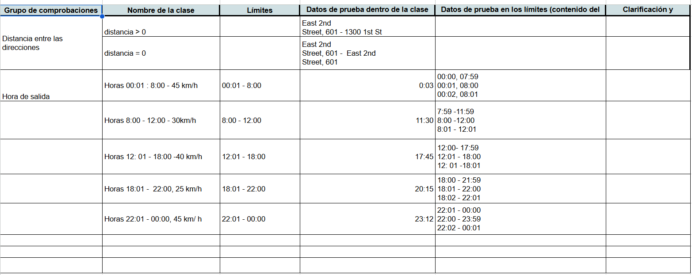

## Bienvenido/a a mi portafolio  👋

  <strong>QA ENGINEER · QA MANUAL TESTER · QA DOCUMENTADOR · QA AUTOMATIZADOR JUNIOR</strong>

  
  

---

## 📋 Índice

1. [🚀 Sobre mí](#-sobre-mí)  
2. [🛠️ Tech Stack](#️-tech-stack)  
3. [📂 Proyectos Destacados](#-proyectos-destacados)  
4. [📄 CV Profesional](#-cv-profesional)  
5. [📬 ¿Hablemos?](#-hablemos)

---
## 🚀 Sobre mí

Soy un profesional con formación en Contabilidad, especializado en **Quality Assurance (QA)**. Combino habilidades técnicas en **pruebas manuales y automatizadas**, manejo de herramientas como **Postman y JIRA**.

Mi enfoque está en **mejorar la calidad del software**, colaborar con equipos ágiles y optimizar procesos con pensamiento crítico y proactividad.

---

Además, cuento con experiencia en:

- ✍️ **Redacción de planes de prueba**, **historias de usuario** y **casos de uso**.
- 🧪 **Diseño y ejecución de casos de prueba** funcionales y de regresión.
- 🐞 **Reporte de defectos** con análisis de severidad/prioridad en JIRA.
- 🧠 **Aplicación de técnicas de testing** como:
  - Partición de equivalencias
  - Análisis de valores límites
  - Tablas de decisión
  - Casos de uso
- 🔄 **Pruebas de APIs REST usando Postman**, ejecutando operaciones **CRUD**.
    
---

## 🛠️ Tech Stack

### 🧪 QA & Testing

  
  

### 📋 Gestión & Documentación

  
  
  
  

---

## 📂 Proyectos Destacados

## 🛒 Urban.Grocers – Aplicación web para comprar comestibles
Este proyecto consistio en la validación del backend de **Urban.Grocers**, una aplicación web para la compra de comestibles. Estudié la documentación técnica en **Apidoc**, analicé los requisitos de una nueva funcionalidad y diseñé una **lista de comprobación** centrada en flujos de datos y respuestas esperadas.

Ejecuté pruebas a través de **Postman**, cubriendo distintos escenarios positivos y negativos, y reporté los errores detectados en **JIRA** con la documentación correspondiente. El enfoque fue garantizar la calidad y estabilidad de los endpoints antes del despliegue.

**Resultados destacados:**
- 📄 Analicé la documentación técnica del backend y API.  
- ✔️ Diseñé **49 casos de prueba**, identificando y reportando **11 errores en JIRA**.
- 🔍 Probé **endpoints en Postman** y documenté errores en **JIRA**, incluyendo estructura de JSON y respuestas esperadas.

**Aptitudes:**

**Enlace:** [Documentación](https://drive.google.com/drive/folders/1s_w-Ov7i4E2QBYSOPK8r9XVALrmIBvdo?usp=sharing)

    

    

    

    

    

---

## 🚕 Urban.Routes – Aplicación web para reserva de taxis
Realicé pruebas de regresión para **Urban.Routes**, una app que calcula rutas, duración y precios para distintos medios de transporte. Validé la lógica de negocio mediante técnicas como **clases de equivalencia** y **valores límite**, diseñando casos de prueba detallados y un **diagrama de flujo** para la funcionalidad de auto compartido.

Elaboré listas de comprobación para validar el diseño del formulario de reserva, las ventanas emergentes, y funciones clave como “Agregar tarjeta”, “Método de pago” y el botón "Reservar". Finalmente, ejecuté las pruebas funcionales en dos entornos (Chrome y Firefox con resoluciones específicas), y documenté errores encontrados en **JIRA**.

**Resultados destacados:**
- ✔️ Diseñé listas de comprobación para UI y flujos críticos.  
- 🧪 Preparé y ejecuté **casos de prueba positivos y negativos**.  
- 🧭 Validé funcionalidades clave en diferentes resoluciones y navegadores.  
**Aptitudes:**

**Enlace:** [Documentación](https://drive.google.com/drive/folders/1SfYLoG6OPqzStbg_0ZTFZfm-Z79V_m2R?usp=sharing)

**Capturas del proyecto:**  

    

    

**Capturas del proyecto:**  

    

    

---

## 📄 CV Profesional

  

---

## 📬 ¿Trabajamos juntos?

Gracias por tomarte el tiempo de visitar mi portafolio.  
Estoy en búsqueda activa de oportunidades como **QA Manual**, **QA Automatizador Junior** o roles híbridos, donde pueda contribuir con análisis detallado, pensamiento crítico y enfoque en la mejora continua de la calidad del software.

---

Me interesa colaborar con **consultoras TI**, **startups con visión tecnológica** o **instituciones financieras** que valoren procesos de testing bien estructurados y documentación clara.

<strong>✨ ¡Conversemos! Estoy listo para sumarme a tu equipo.</strong>

---
Credits: (arturolopman.github.io)
<!--

**CarlosABH/CarlosABH** is a ✨ _special_ ✨ repository because its `README.md` (this file) appears on your GitHub profile.

